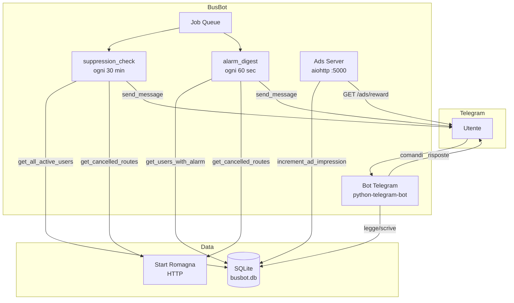
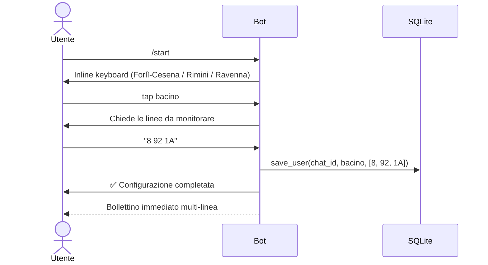
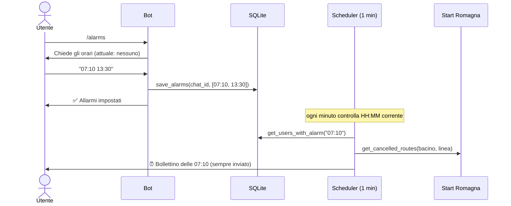
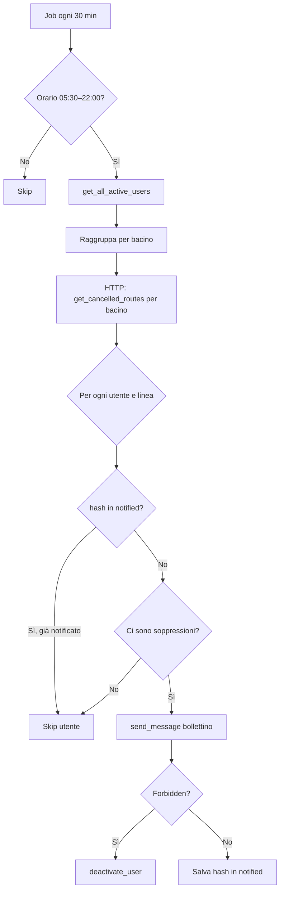
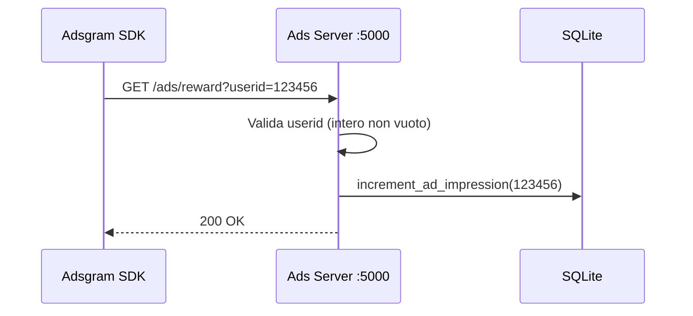
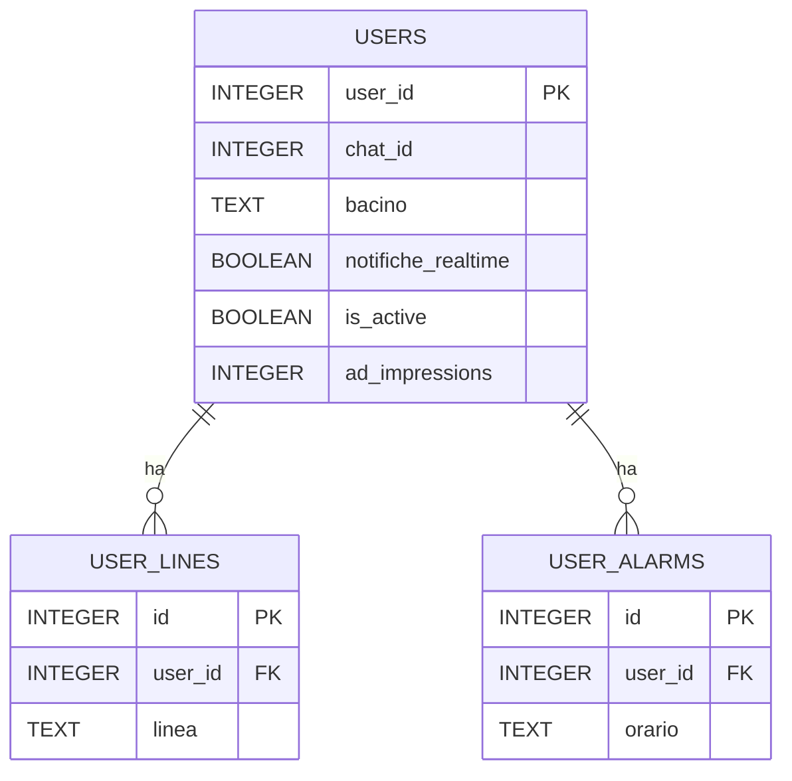
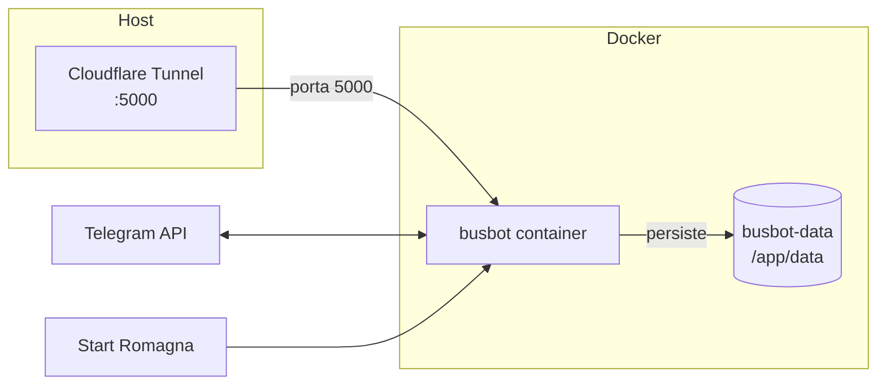

# 🚍 BusBot v2.0

Bot Telegram che monitora le **corse non garantite** di [Start Romagna](https://servizi.startromagna.it/corsesoppresse/corsesopp) e notifica gli utenti quando le loro linee vengono soppresse nelle province di Forlì-Cesena, Rimini e Ravenna.

---

## Indice

- [Funzionalità](#-funzionalità)
- [Architettura](#-architettura)
- [Struttura del Progetto](#-struttura-del-progetto)
- [Flussi Principali](#-flussi-principali)
- [Database](#-database)
- [Variabili d'Ambiente](#-variabili-dambiente)
- [Comandi Bot](#-comandi-bot)
- [Deploy](#-deploy)
- [Testing](#-testing)

---

## ✨ Funzionalità

| Feature | Descrizione |
|---|---|
| **Multi-linea** | Ogni utente può monitorare più linee contemporaneamente (es. `8 92 1A`) |
| **Multi-orario (Sveglia Pendolare)** | Bollettino programmato a orari fissi definiti dall'utente (es. `07:10 13:30`) |
| **Notifiche real-time** | Alert immediato alla prima comparsa di una soppressione (opt-in) |
| **Deduplicazione** | Nessuna notifica ripetuta per la stessa soppressione già inviata |
| **Adsgram** | Banner pubblicitario opzionale nel bollettino periodico tramite Mini App |
| **Migrazione da v1** | Script idempotente `db/migrate.py` per importare `user_config.json` |
| **Docker-ready** | Persistenza SQLite su volume named, porta ads configurabile |

---

## 🏗 Architettura



---

## 📁 Struttura del Progetto

```text
BusBot/
├── main.py                       # Entry point: avvia bot, scheduler, ads server
│
├── bot/
│   ├── conversations.py          # ConversationHandler: /start, /alarms
│   └── handlers.py               # Comandi semplici: /check, /status, /stop, /realtime
│
├── db/
│   ├── database.py               # CRUD SQLite (WAL, 3 tabelle, short-lived connections)
│   └── migrate.py                # Migrazione idempotente user_config.json → SQLite
│
├── services/
│   ├── scraper.py                # Scraper Start Romagna + retry HTTP
│   ├── notifications.py          # Formattazione messaggi HTML Telegram
│   └── ads.py                    # Server aiohttp /ads/reward (porta 5000)
│
├── scheduler/
│   ├── suppression_check.py      # Job 30 min: notifiche soppressioni
│   └── alarm_digest.py           # Job 1 min: bollettino programmato
│
└── tests/
    ├── test_busbot.py            # Scraper, matching, formattazione
    ├── test_db.py                # CRUD SQLite + migrate
    ├── test_ads.py               # Endpoint /ads/reward
    └── test_scheduler.py         # Deduplicazione multi-linea
```

---

## 🔄 Flussi Principali

### Setup utente (`/start`)



### Sveglia Pendolare (`/alarms`)



### Controllo periodico soppressioni (ogni 30 min)



### Endpoint Adsgram (`GET /ads/reward`)



---

## 🗄 Database

Schema SQLite con 3 tabelle e foreign key in cascade:



**Note implementative:**
- WAL mode abilitato per concorrenza in lettura
- Connessioni short-lived (aperta/chiusa per ogni operazione)
- `UNIQUE(user_id, linea)` e `UNIQUE(user_id, orario)` prevengono duplicati a livello DB
- `ON DELETE CASCADE` mantiene l'integrità quando un utente viene cancellato

---

## 🔧 Variabili d'Ambiente

Copia `.env.example` in `.env` e compila:

| Variabile | Obbligatoria | Default | Descrizione |
|---|---|---|---|
| `TELEGRAM_BOT_TOKEN` | ✅ | — | Token del bot da [@BotFather](https://t.me/botfather) |
| `DB_PATH` | ❌ | `busbot.db` | Percorso del file SQLite |
| `ADS_SERVER_PORT` | ❌ | `5000` | Porta del server Adsgram reward |
| `ADSGRAM_BLOCK_ID` | ❌ | — | Block ID Adsgram (es. `bot-24237`) |
| `ADSGRAM_BOT_URL` | ❌ | — | URL della TUA Mini App creata in BotFather (es. `https://t.me/CesenaBusBot/ads`) |

---

## 💰 Monetizzazione e Supporto

BusBot supporta in modo nativo 2 sistemi di monetizzazione paralleli per non infastidire gli utenti ma garantirti comunque guadagni:

### 1. Telegram Stars (Donazioni Attive)
L'utente invia `/donate` e sceglie un importo in Telegram Stars (es. 50⭐ = Caffè).
- Transazione **complessivamente nativa** all'interno dell'app Telegram (non serve gateway in BotFather)
- Ringraziamento istantaneo all'utente e registrazione operazione

### 2. Adsgram (Pubblicità Automatica Passiva)
Se configuri `ADSGRAM_BLOCK_ID` e `ADSGRAM_BOT_URL` nel `.env`, BusBot includerà in automatico un bottone inline *📢 Supporta BusBot (Ads)* sotto **ogni singola** notifica realtime e allarme.

**Integrazione Tecnica:**
1. Le adsgram su bot girano tramite Mini App (per via del blocco nativo su bot).
2. Nelle variabili `.env` definisci l'URL della Mini App collegata (`ADSGRAM_BOT_URL`, es. `https://t.me/TuoBot/ads`) e l'ID del blocco creato su Adsgram (`ADSGRAM_BLOCK_ID`).
3. Quando l'utente preme il bottone inline, si apre l'url usando la formattazione deep-linking di Telegram (`startapp`).
4. Al termine dell'annuncio, il webSDK di Adsgram fa una GET all'endpoint di callback (porta `5000`), incrementando le _ad_impressions_ nel Database.

```env
ADSGRAM_BLOCK_ID=bot-24237
ADSGRAM_BOT_URL=https://t.me/TuoBot/ads
ADS_SERVER_PORT=5000
```
---

## 📋 Comandi Bot

| Comando | Descrizione |
|---|---|
| `/start` | Setup iniziale o riconfigurazione (bacino + linee multiple) |
| `/check` | Controllo immediato delle soppressioni per tutte le linee |
| `/alarms` | Imposta orari sveglia pendolare (es. `07:10 13:30`) — invia `0` per rimuovere |
| `/realtime` | Abilita/disabilita notifiche istantanee a ogni nuova soppressione |
| `/status` | Mostra configurazione completa (linee, alarms, realtime, impressioni ads) |
| `/stop` | Disattiva il monitoraggio |
| `/cancel` | Annulla la conversazione corrente |

---

## 🚀 Deploy

### Locale

```bash
# 1. Installa dipendenze
pip install -r requirements.txt

# 2. Configura ambiente
cp .env.example .env
# → modifica TELEGRAM_BOT_TOKEN

# 3. (Opzionale) Migra dati da v1
python -m db.migrate --json-path user_config.json

# 4. Avvia
python main.py
```

### Docker (consigliato per Raspberry Pi)

```bash
docker compose up -d --build
```

Il database SQLite è persistito nel volume named `busbot-data` montato in `/app/data/`.  
Il server Adsgram è raggiungibile su `http://host:5000/ads/reward`.



