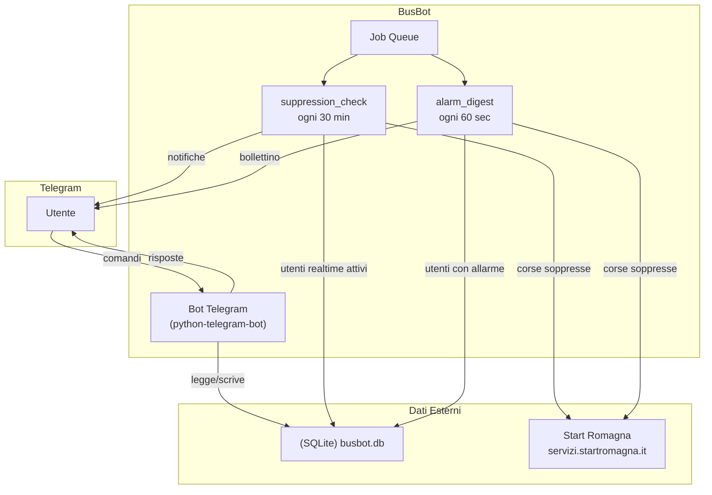
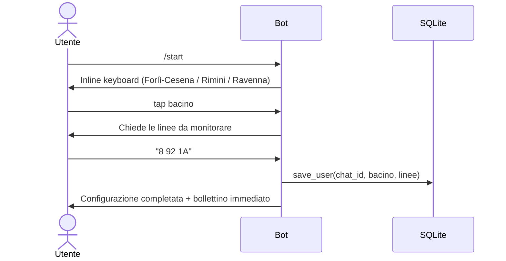
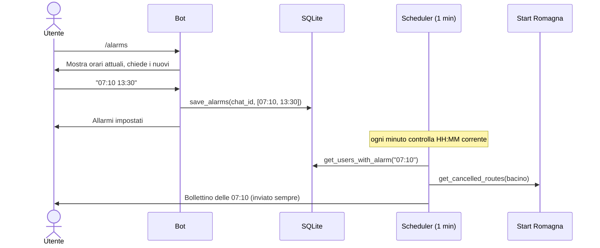
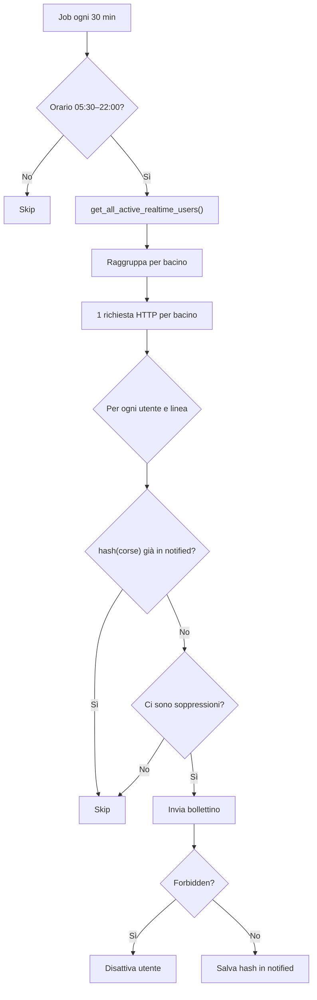
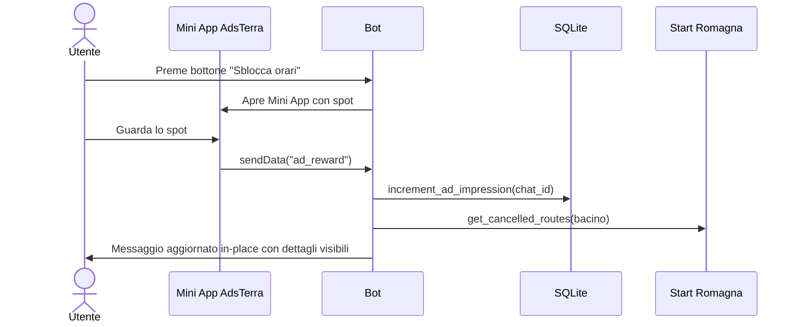
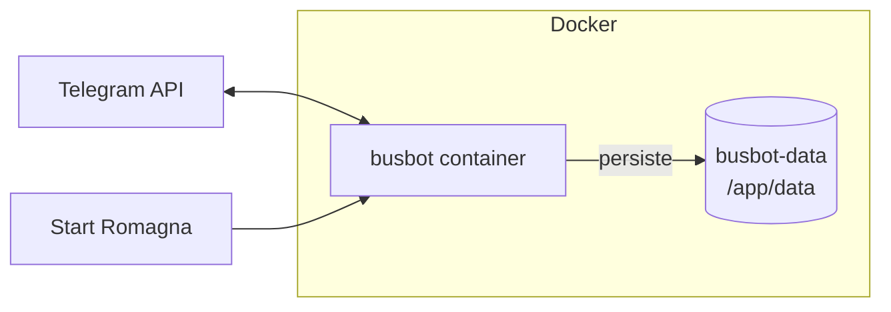

# BusBot v2.0

Bot Telegram per il monitoraggio delle corse non garantite di **Start Romagna** (province di Forlì-Cesena, Rimini e Ravenna). Scrapa periodicamente il sito ufficiale delle corse soppresse e notifica gli utenti per le linee di autobus che stanno monitorando.

---

## Indice

- [Architettura](#architettura)
- [Struttura del progetto](#struttura-del-progetto)
- [Componenti](#componenti)
  - [Entry point](#entry-point)
  - [Bot — Comandi e conversazioni](#bot--comandi-e-conversazioni)
  - [Services](#services)
  - [Scheduler](#scheduler)
  - [Database](#database)
- [Monetizzazione](#monetizzazione)
- [Flussi principali](#flussi-principali)
- [Variabili d'ambiente](#variabili-dambiente)
- [Deploy](#deploy)
- [Testing](#testing)

---

## Architettura

Il sistema è composto da un bot Telegram in long polling, due job schedulati e un database SQLite locale. Non ci sono server HTTP esposti: tutte le interazioni avvengono tramite l'API Telegram.



---

## Struttura del progetto

```text
BusBot/
├── main.py                       # Entry point
│
├── bot/
│   ├── conversations.py          # ConversationHandler: /start, /alarms
│   ├── handlers.py               # Comandi: /check, /status, /stop, /realtime + reward WebApp
│   └── stars.py                  # Donazioni via Telegram Stars: /donate
│
├── db/
│   ├── database.py               # Layer SQLite (WAL, 3 tabelle, connessioni short-lived)
│   └── migrate.py                # Migrazione idempotente da JSON v1 a SQLite v2
│
├── services/
│   ├── scraper.py                # Scraping Start Romagna (aiohttp, retry, BeautifulSoup)
│   ├── notifications.py          # Formattazione messaggi HTML + logica bottone ads
│   └── ads.py                    # Sblocco in-place del messaggio dopo visione spot
│
├── scheduler/
│   ├── suppression_check.py      # Job 30 min: notifiche soppressioni (solo utenti realtime)
│   └── alarm_digest.py           # Job 1 min: bollettino programmato
│
├── tests/
│   ├── test_busbot.py            # Parsing HTML, matching linee, formattazione messaggi
│   ├── test_db.py                # CRUD utenti, allarmi, realtime, ads, migrazione
│   ├── test_ads.py               # Logica unlock e impressions
│   └── test_scheduler.py         # Hash e deduplicazione
│
├── Dockerfile
├── docker-compose.yml
├── requirements.txt
└── .env.example
```

---

## Componenti

### Entry point

**`main.py`** inizializza il database, registra tutti gli handler sul bot e avvia due job ripetitivi sulla job queue di `python-telegram-bot`:

| Job | Intervallo | Descrizione |
|-----|-----------|-------------|
| `suppression_check_job` | 30 minuti | Controlla soppressioni per utenti con notifiche real-time attive |
| `alarm_digest_job` | 60 secondi | Invia bollettino agli utenti con un allarme impostato all'orario corrente |

Il bot gira in modalità **long polling** (`app.run_polling()`).

---

### Bot — Comandi e conversazioni

#### `bot/conversations.py`

Due `ConversationHandler` indipendenti, entrambi con `allow_reentry=True`:

**`/start`** — Setup iniziale (2 stati):
1. `SCEGLI_BACINO` — inline keyboard con 3 bacini (Forlì-Cesena, Rimini, Ravenna)
2. `SCEGLI_LINEE` — l'utente invia le linee come testo libero (es. `8 92 1A`)
3. Salvataggio via `db.save_user()` (upsert) + check immediato delle corse

**`/alarms`** — Sveglia del pendolare (1 stato):
1. `INSERISCI_ALARMS` — l'utente invia orari in formato `HH:MM` separati da spazio
2. Validazione con regex `^\d{2}:\d{2}$`
3. Invio `0` per rimuovere tutti gli allarmi

#### `bot/handlers.py`

| Comando | Funzione | Comportamento |
|---------|----------|---------------|
| `/check` | `check()` | Scrapa le corse per il bacino dell'utente (1 richiesta HTTP), filtra per le sue linee, invia bollettino |
| `/status` | `status()` | Mostra configurazione corrente: stato, bacino, linee, allarmi, supporter |
| `/stop` | `stop()` | Imposta `is_active=0` nel DB |
| `/realtime` | `realtime_toggle()` | Toggle `notifiche_realtime` nel DB |

Gestisce anche il **`MessageHandler` per `WEB_APP_DATA`**: quando la Mini App AdsTerra invia `ad_reward` via `Telegram.WebApp.sendData()`, il bot registra l'ad impression e tenta di sbloccare l'ultimo messaggio in-place. Se l'edit fallisce, invia un nuovo bollettino sbloccato.

#### `bot/stars.py`

Gestione donazioni tramite **Telegram Stars** (valuta `XTR`, nativa in Telegram):

| Importo | Etichetta | Effetto |
|---------|-----------|---------|
| 50 ⭐ | Caffè | Sblocca orari per 24h |
| 150 ⭐ | Pizza | Supporter permanente |
| 500 ⭐ | Abbonamento | Supporter permanente |

Flusso: `/donate` → bottoni inline → `send_invoice` → `PreCheckoutQuery` (risposta obbligatoria entro 10s) → `SuccessfulPayment` → registrazione nel DB.

Donazioni ≥ 150 ⭐ marcano l'utente come **supporter permanente** (`is_permanent_supporter=1`), sbloccando gli orari senza più necessità di spot.

---

### Services

#### `services/scraper.py`

Scraper asincrono per il sito Start Romagna (`servizi.startromagna.it/corsesoppresse/corsesopp`).

- **Client HTTP**: `aiohttp` con timeout di 20 secondi
- **Retry**: massimo 3 tentativi con backoff esponenziale (2, 4, 8 secondi)
- **Parsing**: BeautifulSoup4. La pagina ha due tabelle HTML: una di filtri (con `<input>`) e una di dati. Lo scraper identifica la tabella dati cercando righe con ≥5 `<td>` senza input
- **Formato risultato**: lista di `{linea, inizio, dalle, fine, alle, data}`
- **`linea_matches(row_linea, target)`**: confronto esatto sul primo token (case-insensitive). `"8 Forlì"` matcha `"8"`, ma `"80 Forlì"` non matcha `"8"`

#### `services/notifications.py`

Due funzioni di formattazione per contesti diversi:

| Funzione | Contesto | Header nel messaggio |
|----------|----------|---------------------|
| `format_multiline_bulletin()` | `/check`, notifiche periodiche | `📊 Situazione Attuale` |
| `format_alarm_bulletin()` | Sveglia del pendolare | `⏰ Bollettino delle HH:MM` |

**Meccanismo FOMO per utenti locked** (`is_unlocked=False`): il messaggio non rivela se ci sono soppressioni o meno. Mostra un generico `🟠 Potrebbero esserci variazioni sulle tue linee` indipendentemente dalla situazione reale. I dettagli (fermata di partenza/arrivo, orario) sono visibili solo dopo lo sblocco.

**`get_ad_markup(chat_id)`**: genera un `ReplyKeyboardMarkup` con bottone WebApp per lo spot AdsTerra. Ritorna `None` se:
- `ADSTERRA_WEBAPP_URL` non è configurato
- L'utente è un supporter permanente
- L'utente ha già guardato uno spot oggi

#### `services/ads.py`

**`unlock_message_for_user(bot, chat_id)`**: dopo che l'utente guarda lo spot, questa funzione:
1. Recupera l'utente e il suo `last_message_id` dal DB
2. Ri-scrapa le corse aggiornate
3. Genera il bollettino in chiaro (`is_unlocked=True`)
4. Chiama `bot.edit_message_text()` per aggiornare il messaggio precedente in-place
5. Ritorna `True` se l'edit ha successo, `False` se il messaggio non è più modificabile

---

### Scheduler

#### `scheduler/suppression_check.py` — Job ogni 30 minuti

1. **Finestra oraria**: attivo solo tra le 05:30 e le 22:00 (fuso `Europe/Rome`)
2. **Filtro utenti**: solo quelli con `is_active=1` e `notifiche_realtime=1`
3. **Ottimizzazione HTTP**: raggruppa utenti per bacino → 1 sola richiesta HTTP per bacino
4. **Deduplicazione**: per ogni combinazione `(chat_id, linea)` calcola un hash deterministico delle corse. Se l'hash è già nel dict `notified` (in `context.bot_data`), la notifica viene saltata
5. **Notifica**: invia solo se ci sono **cambiamenti** (hash nuovo) **e** ci sono **soppressioni attive**
6. **Pulizia giornaliera**: il dict `notified` viene svuotato a mezzanotte
7. **Gestione bot bloccato**: `telegram.error.Forbidden` → disattiva automaticamente l'utente

L'hash utilizza `linea` e `dalle` di ogni corsa, ordinati alfabeticamente e concatenati con `|`.

#### `scheduler/alarm_digest.py` — Job ogni 60 secondi

1. Controlla l'orario corrente (`HH:MM`, fuso `Europe/Rome`)
2. Query `get_users_with_alarm(now)` — tutti gli utenti attivi con allarme a quell'ora
3. Per ogni utente: scrapa le corse e invia il bollettino
4. **Invia sempre**, indipendentemente dalla presenza di soppressioni (a differenza del suppression_check)
5. Gestione `Forbidden` come sopra

---

### Database

**`db/database.py`** — Layer SQLite con connessioni short-lived e WAL mode.

#### Schema

```sql
-- Tabella principale utenti
CREATE TABLE users (
    user_id                INTEGER PRIMARY KEY,
    chat_id                INTEGER NOT NULL,
    bacino                 TEXT    NOT NULL,
    notifiche_realtime     BOOLEAN DEFAULT 0,
    is_active              BOOLEAN DEFAULT 1,
    ad_impressions         INTEGER DEFAULT 0,
    last_ad_date           TEXT    DEFAULT NULL,   -- ISO date (YYYY-MM-DD)
    last_message_id        INTEGER DEFAULT NULL,   -- per edit in-place
    is_permanent_supporter BOOLEAN DEFAULT 0
);

-- Linee monitorate (relazione 1:N)
CREATE TABLE user_lines (
    id      INTEGER PRIMARY KEY AUTOINCREMENT,
    user_id INTEGER NOT NULL REFERENCES users(user_id) ON DELETE CASCADE,
    linea   TEXT    NOT NULL,
    UNIQUE (user_id, linea)
);

-- Allarmi pendolari (relazione 1:N)
CREATE TABLE user_alarms (
    id      INTEGER PRIMARY KEY AUTOINCREMENT,
    user_id INTEGER NOT NULL REFERENCES users(user_id) ON DELETE CASCADE,
    orario  TEXT    NOT NULL,   -- HH:MM
    UNIQUE (user_id, orario)
);
```

#### Configurazione SQLite
- **WAL mode**: `PRAGMA journal_mode=WAL` per concorrenza in lettura
- **Foreign keys**: `PRAGMA foreign_keys=ON` con `ON DELETE CASCADE`
- **Connessioni short-lived**: apri → committa → chiudi (context manager `_conn()`)
- **Migrazioni inline**: colonne aggiunte con `ALTER TABLE ADD COLUMN` in `init_db()`, wrappate in try/except per idempotenza

#### Funzioni principali

| Funzione | Descrizione |
|----------|-------------|
| `init_db()` | Crea tabelle e indici, esegue migrazioni |
| `save_user(chat_id, bacino, linee)` | Upsert utente + replace atomico delle linee |
| `get_user(chat_id)` | Ritorna dict con `linee[]` e `alarms[]` |
| `deactivate_user(chat_id)` | `is_active=0` |
| `get_all_active_users()` | Tutti gli utenti attivi |
| `get_all_active_realtime_users()` | Utenti attivi con `notifiche_realtime=1` |
| `get_users_with_alarm(orario)` | JOIN utenti+allarmi per `HH:MM` |
| `save_alarms(chat_id, orari)` | Replace atomico degli allarmi |
| `set_realtime(chat_id, enabled)` | Toggle notifiche real-time |
| `increment_ad_impression(user_id)` | +1 counter, aggiorna `last_ad_date` a oggi |
| `is_unlocked(chat_id)` | `True` se supporter permanente oppure ha visto spot oggi |
| `set_permanent_supporter(chat_id)` | `is_permanent_supporter=1` |
| `update_last_message_id(user_id, msg_id)` | Salva ID per edit in-place |

#### `db/migrate.py`

Script CLI per migrare da BusBot v1 (`user_config.json`) a v2 (SQLite).

```bash
python -m db.migrate [--json-path PATH]
```

- Idempotente: salta utenti già presenti
- Preserva il flag `active` dall'originale
- Logga OK / Skipped / Errors

---

## Monetizzazione

Due sistemi paralleli per sbloccare gli orari esatti delle corse soppresse.

Senza sblocco, l'utente vede un messaggio generico (`🟠 Potrebbero esserci variazioni`) senza sapere se ci sono effettivamente soppressioni. Dopo lo sblocco, vede il bollettino completo con fermate e orari.

### Telegram Stars

Donazioni native tramite la valuta in-app di Telegram (`XTR`). Gestite da `bot/stars.py`.

- Donazioni < 150 ⭐: sbloccano gli orari per 24h (come guardare uno spot)
- Donazioni ≥ 150 ⭐: marcano l'utente come **supporter permanente** — gli orari sono sempre visibili, il bottone ads non viene più mostrato

### AdsTerra (spot pubblicitario)

Opzionale. Attivabile configurando `ADSTERRA_WEBAPP_URL` nel `.env`.

Quando attivo, ogni bollettino per utenti non sbloccati include un bottone keyboard che apre una Mini App Telegram con uno spot AdsTerra. Dopo la visione, la Mini App invia `ad_reward` via `Telegram.WebApp.sendData()`. Il bot registra l'impression (`last_ad_date = oggi`) e aggiorna il bollettino in-place con i dettagli visibili.

Lo sblocco tramite spot dura **24 ore** (basato su `last_ad_date`).

---

## Flussi principali

### Setup utente (`/start`)



### Sveglia del pendolare (`/alarms`)



### Controllo periodico soppressioni (suppression_check, ogni 30 min)



### Sblocco tramite spot AdsTerra



---

## Variabili d'ambiente

Copiare `.env.example` in `.env` e configurare:

| Variabile | Obbligatoria | Default | Descrizione |
|-----------|:---:|---------|-------------|
| `TELEGRAM_BOT_TOKEN` | sì | — | Token del bot ottenuto da BotFather |
| `DB_PATH` | no | `busbot.db` | Percorso del file SQLite |
| `ADSTERRA_WEBAPP_URL` | no | — | URL della pagina Mini App con lo spot AdsTerra. Se non impostato, il bottone ads non viene mostrato |

---

## Deploy

### Locale

```bash
pip install -r requirements.txt
cp .env.example .env
# Configurare TELEGRAM_BOT_TOKEN nel .env

# (Opzionale) Migra dati da v1
python -m db.migrate --json-path user_config.json

python main.py
```

### Docker

```bash
docker compose up -d --build
```

Il database è persistito nel volume named `busbot-data`, montato su `/app/data/busbot.db`.



Il `Dockerfile` usa Python 3.13-slim, copia i sorgenti e avvia `main.py`. Non espone porte: il bot comunica esclusivamente con l'API Telegram in outbound.

---

## Testing

```bash
# Unit test (esclusi test di integrazione che richiedono rete)
python -m pytest tests/ -v -k "not TestFetchReale"

# Tutti i test, inclusi quelli che contattano il sito Start Romagna
python -m pytest tests/ -v
```

Copertura delle test suite:

| File | Cosa testa |
|------|-----------|
| `test_busbot.py` | Parsing HTML dello scraper, `linea_matches`, formattazione messaggi (locked/unlocked) |
| `test_db.py` | CRUD utenti, linee, allarmi, toggle realtime, ad impressions, migrazione JSON→SQLite |
| `test_ads.py` | Incremento impressions, `is_unlocked`, supporter permanente |
| `test_scheduler.py` | Determinismo e ordine-indipendenza dell'hash, deduplicazione per linea/utente |

I test del database usano file temporanei con `patch.object(db, "DB_PATH")` per isolamento completo.

I test di integrazione (`TestFetchReale`) contattano realmente il sito Start Romagna per verificare che il parsing funzioni con l'HTML live.
